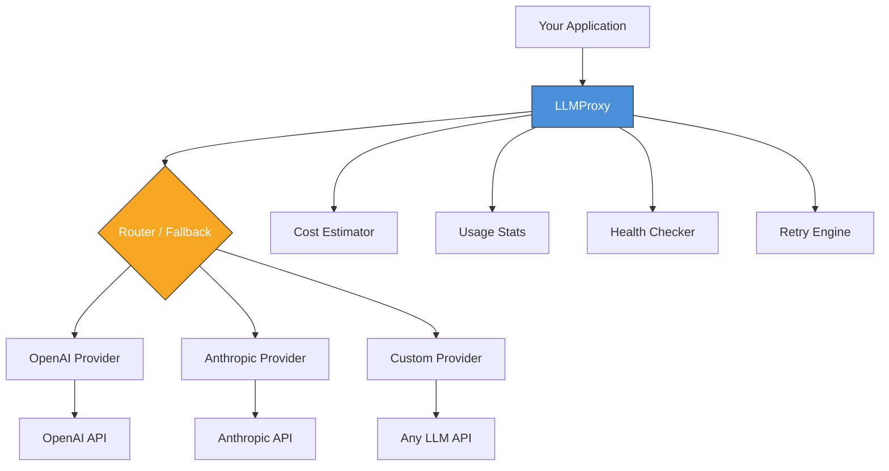

# LLMProxy

[](https://github.com/officethree/LLMProxy/actions/workflows/ci.yml)
[](https://www.python.org/downloads/)
[](LICENSE)
[](https://pypi.org/project/llmproxy/)

**Unified API proxy for multiple LLM providers.** A Python library that provides a single interface for calling OpenAI, Anthropic, and other LLM APIs with automatic fallback and load balancing.

---

## Architecture



## Features

- **Multi-provider support** — OpenAI, Anthropic, and extensible to any LLM API
- **Automatic fallback** — Define fallback chains so requests reroute on failure
- **Load balancing** — Distribute requests across providers
- **Cost estimation** — Estimate token costs before sending requests
- **Usage tracking** — Monitor request counts, tokens, and costs per provider
- **Health checks** — Verify provider availability in real time
- **Configurable retries** — Exponential backoff with jitter out of the box
- **Pydantic models** — Fully typed request/response objects

## Quickstart

### Installation

```bash
pip install llmproxy
```

Or install from source:

```bash
git clone https://github.com/officethree/LLMProxy.git
cd LLMProxy
pip install -e ".[dev]"
```

### Basic Usage

```python
from llmproxy import LLMProxy

proxy = LLMProxy()

# Add providers
proxy.add_provider("openai", {
    "api_key": "sk-...",
    "base_url": "https://api.openai.com/v1",
})
proxy.add_provider("anthropic", {
    "api_key": "sk-ant-...",
    "base_url": "https://api.anthropic.com/v1",
})

# Set fallback order
proxy.set_fallback_chain(["openai", "anthropic"])

# Generate a completion
response = await proxy.complete(
    prompt="Explain quantum computing in one paragraph.",
    model="gpt-4o",
    provider="openai",
)
print(response.content)
```

### Cost Estimation

```python
estimate = proxy.estimate_cost("Write a haiku about Python.", model="gpt-4o")
print(f"Estimated cost: ${estimate['estimated_cost']:.6f}")
```

### Health Checks

```python
status = await proxy.health_check("openai")
print(f"OpenAI healthy: {status['healthy']}")
```

### Usage Stats

```python
stats = proxy.get_usage_stats()
for provider, data in stats.items():
    print(f"{provider}: {data['request_count']} requests, ${data['total_cost']:.4f}")
```

## Configuration

Copy `.env.example` to `.env` and set your API keys:

```bash
cp .env.example .env
```

See [docs/ARCHITECTURE.md](docs/ARCHITECTURE.md) for detailed design documentation.

## Development

```bash
make install    # Install with dev dependencies
make test       # Run tests
make lint       # Run linter
make format     # Format code
```

## Inspired by

Inspired by [LiteLLM](https://github.com/BerriAI/litellm) and multi-provider LLM trends.

---

Built by **Officethree Technologies** | Made with love and AI
